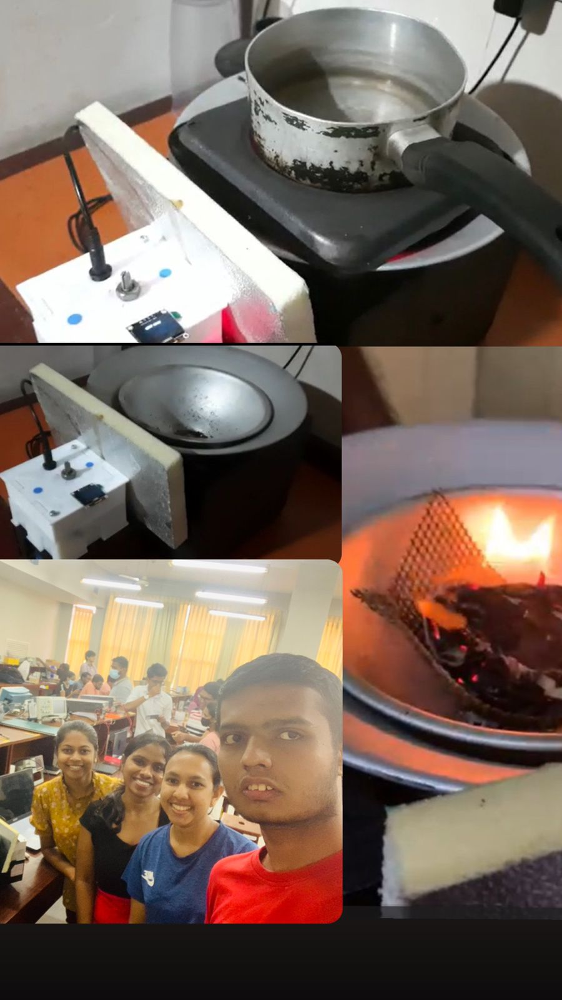

# Smart-Hearth
This is the project that we carried out for the module Engineering Design Project during our second semester.
The smart hearth is equipped with a temperature sensor that helps maintain the fire's temperature based on the user's preferences. This was achieved by adjusting the speed of the DC fan accordingly. The user can select their desired temperature range using a knob on the user interface, and the chosen range will be shown on the OLED display. Safety measures are in place as well, with a buzzer alerting the user in case of any irregularities during operation. The hearth's enclosure design was meticulously crafted using SolidWorks, ensuring the appropriate choice of materials. Additionally, the PCB was carefully designed using Altium.

Amidst the scarcity and rising costs of gas cylinders in Sri Lanka, many households have turned to traditional hearths as an alternative. However, these hearths lack certain user-friendly features, such as the need for constant manual adjustment of the flame and the issue of soot deposition and cleaning after usage. Moreover, the smoke released during cooking can be bothersome.

To address these drawbacks, the idea is to develop a more advanced hearth with a DC fan that automatically regulates the heat once the user inputs their desired temperature. This innovation aims to save time and effort for consumers and make cooking more convenient.

To validate the demand for such a product, a survey was conducted among potential users. The results indicated that over 50% of respondents were significantly affected by the gas shortage, making an alternative like this hearth desirable. Most participants showed positive interest in purchasing the product, and none felt it was unnecessary.
This Smart Hearth represents the culmination of our team's passion for innovation and dedication to addressing real-world challenges. Through meticulous design, seamless integration of advanced features, and careful consideration of user needs, we have created a product that promises to revolutionize cooking experiences and offer a viable alternative amidst the gas cylinder shortage. With the support of positive survey feedback, we are confident that our Smart Hearth has the potential to make a significant impact, enhancing convenience and sustainability for households seeking a smarter way to cook.

# Smart Hearth Project

## Table of Contents
- [Introduction](#introduction)
- [Features](#features)
- [Installation](#installation)
- [Usage](#usage)
- [Technologies Used](#technologies-used)

## Introduction

The Smart Hearth Project is a home automation solution that enhances your fireplace experience. It integrates modern technology with traditional fireplace aesthetics to provide a safe, convenient, and eco-friendly way to manage your hearth. This README.md file serves as a guide to set up and use the Smart Hearth system.

## Features

- **Remote Control:** Control your fireplace remotely using a mobile app or voice commands.
- **Safety:** Smart sensors monitor the temperature and ensure safe operation.
- **Energy Efficiency:** Optimize heating and reduce energy consumption.
- **Customization:** Personalize your fireplace settings to suit your preferences.
- **Logs and Statistics:** Keep track of usage and energy savings.

## Installation

### Prerequisites

Before you begin, ensure you have met the following requirements:

- A compatible fireplace with a control interface.
- Raspberry Pi or similar single-board computer.
- Smart sensors (temperature and CO2 sensors).
- Mobile device with the Smart Hearth app (iOS/Android).

